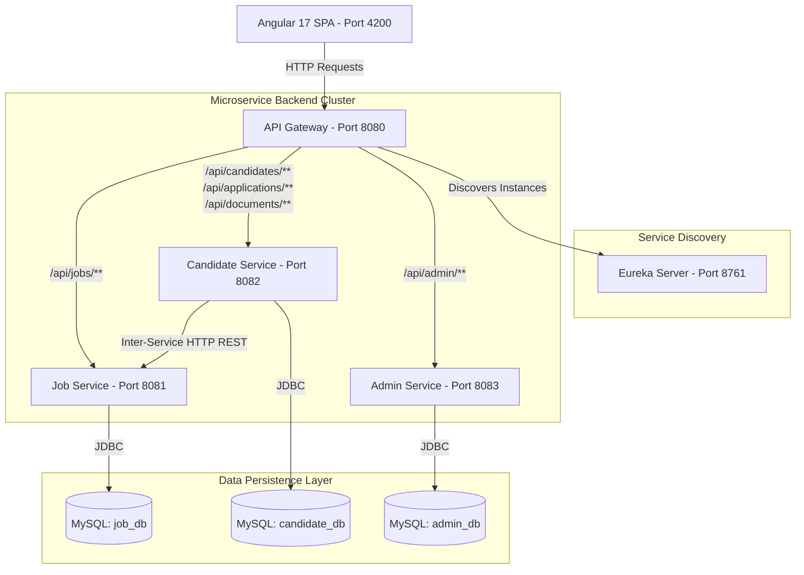
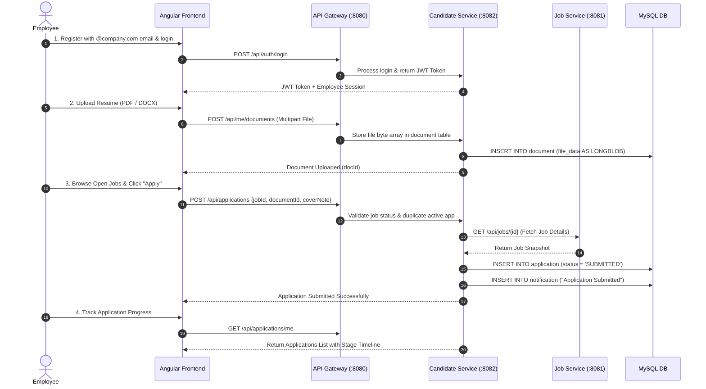
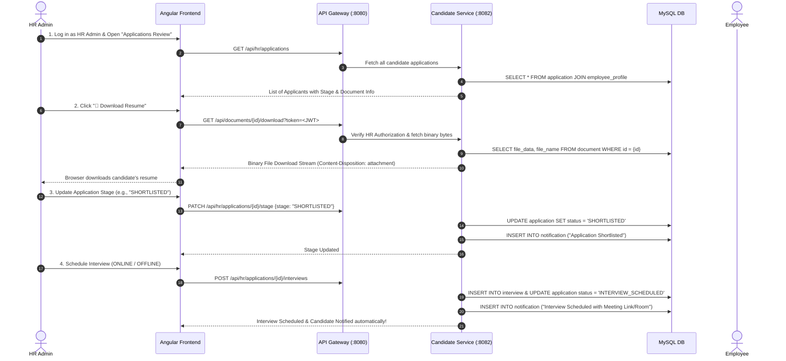

# INTERNAL JOB POSTING (IJP) ENTERPRISE SYSTEM
## Comprehensive End-to-End System Documentation & Viva Explanation Guide

---

## 1. Executive Summary & Problem Statement

### 1.1 What is the Internal Job Posting (IJP) System?
The **Internal Job Posting (IJP) System** is a enterprise web application designed to facilitate internal mobility within an organization. It allows existing employees to discover open job roles within the company, submit applications along with their resumes, track their application progress through hiring stages, and receive real-time interview schedules.

Simultaneously, it empowers **HR Managers and Administrators** to post new job openings, maintain official company designation master records, review candidate applications, download uploaded resumes, manage hiring stage transitions, and schedule interviews.

### 1.2 Core Business Objectives
* **Encourage Internal Talent Mobility**: Enable employees to grow vertically or horizontally across departments.
* **Streamline HR Operations**: Provide a centralized workspace for job posting lifecycle management and applicant tracking.
* **Ensure Data Privacy & Security**: Enforce corporate domain authentication (`@company.com`), role-based access control (RBAC), and secure document storage.
* **Maintain Application State Integrity**: Prevent duplicate active applications, enforce strict withdrawal rules, and deliver automated notifications at every stage.

---

## 2. Technical Stack & Architecture

### 2.1 Technology Stack Matrix

| Layer | Technologies / Frameworks | Purpose |
| :--- | :--- | :--- |
| **Frontend UI** | Angular 17 (Standalone Components), TypeScript, RxJS, CSS3 Design System | Modern, reactive single-page enterprise interface. |
| **API Gateway** | Spring Cloud Gateway (Java 17, Spring Boot 3) | Central HTTP entry point, CORS handling, dynamic routing. |
| **Service Discovery** | Spring Cloud Netflix Eureka Server | Microservice registration and dynamic instance lookup. |
| **Microservices** | Spring Boot 3, Spring Web, Spring Data JPA | Independent business logic microservices. |
| **Database** | MySQL 8 Server | Relational databases (`candidate_db`, `job_db`, `admin_db`). |
| **Security & Auth** | JSON Web Tokens (JWT), BCrypt Password Encoder | Stateless authentication and role-based authorization. |
| **Build & Testing** | Maven 3.8+, JUnit 5, Mockito | Service-layer unit testing and automated build management. |

---

### 2.2 Microservices System Architecture Diagram



---

## 3. Microservices Breakdown & Database Schemas

### 3.1 Service Discovery (`service-discovery`)
* **Port**: `8761`
* **Role**: Acts as the central registry where all backend microservices register their IP address and port upon startup.
* **Key Benefit**: Prevents hardcoding microservice URLs across the system; allows dynamic scaling.

### 3.2 API Gateway (`api-gateway`)
* **Port**: `8080`
* **Role**: Single entry point for all frontend requests. Manages Cross-Origin Resource Sharing (CORS) for `http://localhost:4200` and routes incoming URI paths to target microservices via Eureka:
  * `/api/jobs/**` $\rightarrow$ `lb://JOB-SERVICE`
  * `/api/candidates/**`, `/api/auth/**`, `/api/applications/**`, `/api/hr/**`, `/api/me/**`, `/api/documents/**` $\rightarrow$ `lb://CANDIDATE-SERVICE`
  * `/api/admin/**` $\rightarrow$ `lb://ADMIN-SERVICE`

---

### 3.3 Admin Service (`admin-service`)
* **Port**: `8083` | **Database**: `admin_db`
* **Responsibilities**: HR Admin authentication and management of official designation master records.
* **Database Tables**:
  1. `admin`: Stores HR Admin credentials (`id`, `email`, `password`).
  2. `designation`: Master catalog of official roles (`id`, `name`, `status` [ACTIVE / INACTIVE]).

---

### 3.4 Job Service (`job-service`)
* **Port**: `8081` | **Database**: `job_db`
* **Responsibilities**: Job posting creation, catalog management, lifecycle status transitions, and multi-parameter searching/filtering.
* **Database Table**:
  1. `job_posting`:
     * `id` (PK, Auto-increment)
     * `jobId` (Business Ref ID, e.g., `JOB-101`)
     * `title` & `designation`
     * `department`, `location`, `skillSet`, `experience`
     * `salaryMin` & `salaryMax`
     * `status` (`DRAFT`, `PUBLISHED`, `PAUSED`, `CLOSED`)
     * `postedAt` (Timestamp)

---

### 3.5 Candidate Service (`candidate-service`)
* **Port**: `8082` | **Database**: `candidate_db`
* **Responsibilities**: Employee registration, profile management, job application processing, document/resume storage, HR candidate application review, interview scheduling, and notification delivery.
* **Database Tables**:
  1. `employee_profile`: Stores employee personal and professional records (`id`, `employeeId`, `email`, `password`, `firstName`, `lastName`, `dob`, `designation`, `department`, `skills`, `experienceYears`).
  2. `application`: Stores job application records (`id`, `employeeId`, `jobId`, `jobSnapshotTitle`, `jobSnapshotDesignation`, `jobSnapshotLocation`, `jobSnapshotDepartment`, `coverNote`, `documentId`, `status`, `reviewerNotes`, `submittedAt`).
  3. `document`: Stores resume binary files (`id`, `employeeId`, `fileName`, `contentType`, `fileSize`, `fileData` [LONGBLOB], `uploadedAt`).
  4. `interview`: Stores scheduled interview details (`id`, `applicationId`, `employeeId`, `jobId`, `interviewMode` [ONLINE / OFFLINE], `interviewDate`, `interviewTime`, `location`, `meetingLink`, `interviewer`, `status`).
  5. `notification`: Real-time notification inbox items (`id`, `employeeId`, `title`, `message`, `type`, `read`, `createdAt`).

---

## 4. End-to-End Business Workflows

### 4.1 Employee Workflow (Job Application to Interview)



---

### 4.2 HR Admin Workflow (Review, Resume Download & Interview Scheduling)



---

## 5. Key Add-On Technical Features & Security Architecture

### 5.1 JSON Web Token (JWT) Security Architecture
* **Stateless Authentication**: Upon successful authentication (`/api/auth/login` or `/api/admin/login`), the system generates a cryptographically signed JWT token containing custom claims (`email`, `role`, `employeeId`, `id`, `name`).
* **Header Authorization**: Standard REST API calls send the token via HTTP Header: `Authorization: Bearer <token>`.
* **Direct Browser Download Fallback**: Standard browser direct links (`<a href="..." target="_blank">`) do not send custom HTTP headers. To solve this without compromising security, `CandidateController.downloadDocument` accepts a `?token=` query parameter fallback:
  ```java
  String token = authHeader;
  if ((token == null || token.isEmpty()) && tokenParam != null) {
      token = "Bearer " + tokenParam;
  }
  ```

### 5.2 Password Security & Corporate Domain Enforcement
* **BCrypt Hashing**: All employee and admin passwords are encrypted using `BCryptPasswordEncoder` with salted key hashing before saving to MySQL.
* **Email Domain Validation**: Self-registration strictly mandates that emails end with `@company.com` to prevent external unauthorized registration.

### 5.3 Large Document & Resume Storage (`LONGBLOB`)
* **MySQL BLOB Handling**: Standard Hibernate `@Lob` on MySQL defaults to a 64 KB `BLOB` column, causing data truncation errors on multi-page PDFs.
* **Explicit LongBlob Mapping**: `Document.java` specifies `@Column(columnDefinition = "LONGBLOB")` to support up to 10 MB file uploads.
* **JSON Stream Protection**: The getter `getFileData()` is annotated with `@JsonIgnore` to prevent Jackson JSON serializers from loading or printing raw binary byte streams in REST payloads or terminal outputs.

### 5.4 State Machine & Data Integrity Rules
* **Duplicate Application Prevention**: An employee cannot submit multiple active applications for the same job posting.
* **Terminal Application Protection**: If a candidate withdraws an application (`status = 'WITHDRAWN'`), HR Admins cannot override the stage or schedule interviews. The backend throws an exception, and the Angular UI automatically disables interactive controls.
* **Dynamic Metric Decrementing**: When an employee withdraws an application, the "Active Applications" tile on their dashboard immediately decrements.

---

## 6. Evaluator Viva Q&A Cheat Sheet (Top 15 Questions & Answers)

### Q1: What architecture does this project use, and why?
> **Answer**: The project uses a **Microservices Architecture** with Spring Boot, Spring Cloud Eureka for Service Discovery, Spring Cloud API Gateway for centralized routing/CORS, and an Angular 17 Single Page Application (SPA). Microservices provide independent scalability, loose coupling, and isolated database schemas (`job_db`, `candidate_db`, `admin_db`).

### Q2: How does Service Discovery work with Eureka?
> **Answer**: When each microservice starts up, it registers its name (e.g., `candidate-service`), IP address, and port with the Eureka Server (`port 8761`). The API Gateway queries Eureka dynamically using service IDs like `lb://CANDIDATE-SERVICE` instead of hardcoding IP addresses.

### Q3: How is user authentication managed across microservices?
> **Answer**: Authentication is stateless using **JSON Web Tokens (JWT)**. Upon login, a signed JWT containing user claims (`role`, `employeeId`, `email`) is issued. Subsequent HTTP requests include `Authorization: Bearer <jwt>`, which microservices validate using `JwtUtil`.

### Q4: How did you handle large resume/file uploads in MySQL?
> **Answer**: In `Document.java`, we annotated `fileData` with `@Lob @Column(columnDefinition = "LONGBLOB")` to allow MySQL to store binary data up to 10MB. We also set `spring.servlet.multipart.max-file-size=10MB` in `application.properties` and added `@JsonIgnore` to `getFileData()` to avoid binary output in JSON responses.

### Q5: Why did direct file download fail initially, and how was it fixed?
> **Answer**: Direct browser downloads via `<a href="..." target="_blank">` do not attach custom `Authorization` HTTP headers. We fixed this by modifying `CandidateController.downloadDocument()` to support a `?token=<jwt>` query parameter as an authorized fallback.

### Q6: What happens when an employee withdraws an application?
> **Answer**: The application status changes to `WITHDRAWN`. The backend throws an exception if HR attempts stage transitions or interview scheduling on a withdrawn application. In the UI, HR controls are disabled, and the employee's "Active Applications" metric count immediately decreases.

### Q7: How do you prevent an employee from applying to the same job twice?
> **Answer**: Before creating an application, `CandidateService.applyForJob()` queries `applicationRepository.findByEmployeeIdAndJobIdAndStatusNotIn()` excluding `WITHDRAWN` and `REJECTED`. If an active application exists, it rejects the submission with a clear error message.

### Q8: How are candidate notifications delivered when an interview is scheduled?
> **Answer**: When HR schedules an interview via `scheduleInterview()`, the backend updates the application status to `INTERVIEW_SCHEDULED`, saves the interview record (mode, date, time, meeting link/room), and automatically creates a new record in the `notification` table for that employee.

### Q9: How are passwords stored securely?
> **Answer**: Passwords are never stored in plain text. They are hashed using `BCryptPasswordEncoder`, which applies cryptographic salting before persisting to MySQL.

### Q10: What is the purpose of `@JsonIgnore` on the binary data field?
> **Answer**: Without `@JsonIgnore`, returning a `Document` entity in a REST controller would serialize millions of raw binary bytes into JSON, causing severe memory bloat, high network payload, and terminal freezes when querying or logging.

### Q11: What testing framework was used, and what level of testing was performed?
> **Answer**: We used **JUnit 5** and **Mockito** for unit testing at the **Service Layer**. A total of 34 unit tests were created across all three services, including 24 deep negative test cases.

### Q12: How do your unit tests verify that failed operations leave no side effects?
> **Answer**: In negative test cases, we assert the expected exception with `assertThrows()`, check the exact message, and use `verify(repository, never()).save(any())` to guarantee that invalid inputs never trigger database writes.

### Q13: How does the system validate corporate email domains during registration?
> **Answer**: `CandidateService.registerEmployee()` validates that the email string contains `@` and ends with `@company.com`. If not, it throws a `RuntimeException` rejecting the registration.

### Q14: How does the API Gateway handle CORS?
> **Answer**: `api-gateway` configures `globalcors` in `application.properties`, permitting origins `http://localhost:4200` with HTTP methods `GET, POST, PUT, PATCH, DELETE, OPTIONS` and `allow-credentials: true`.

### Q15: How can the HR Admin view candidate resumes?
> **Answer**: In the HR Applications Review table (`view-candidates.component.html`), a `📄 Download Resume` button appears for applicants who attached a resume. Clicking it triggers the secure `/api/documents/{id}/download?token=...` endpoint, streaming the file directly to HR.
